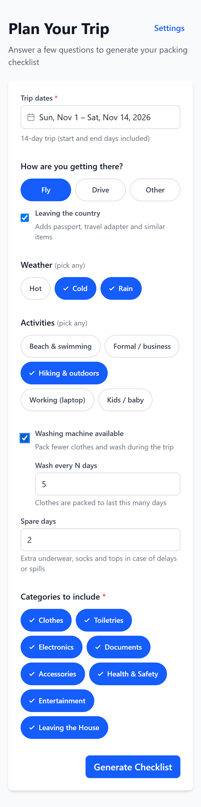
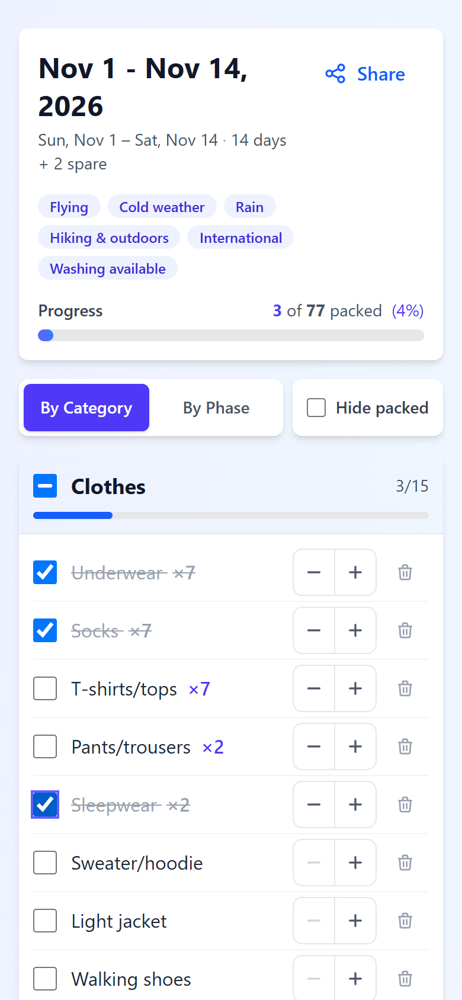
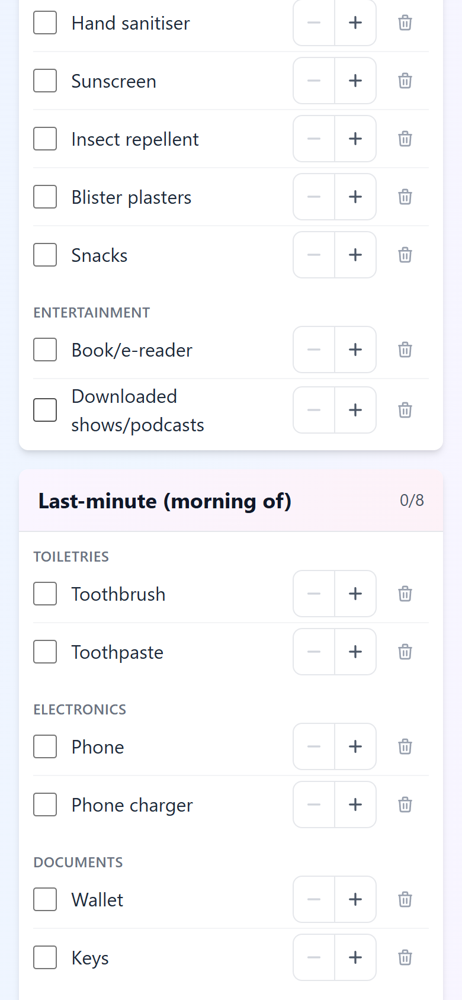
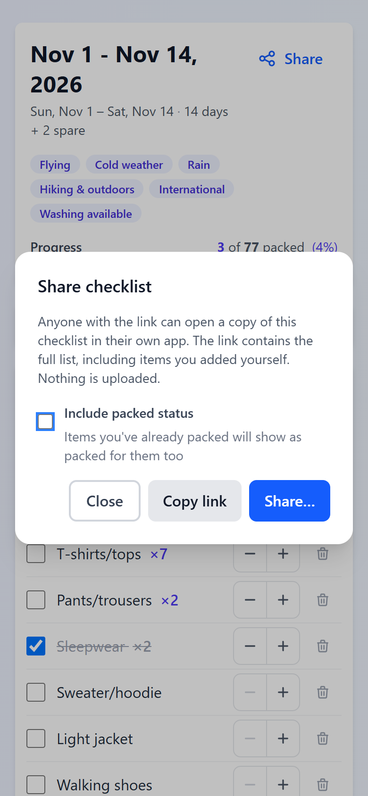
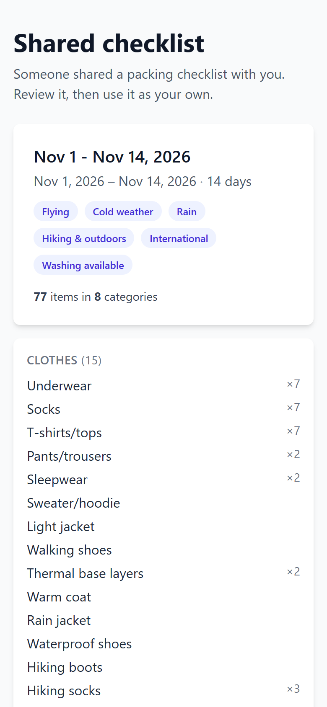
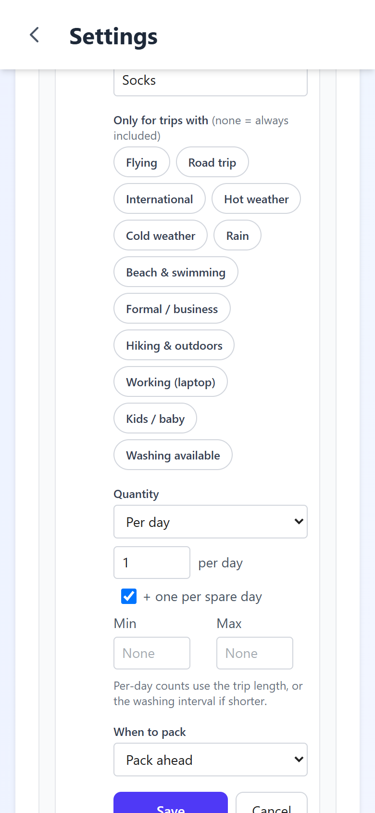
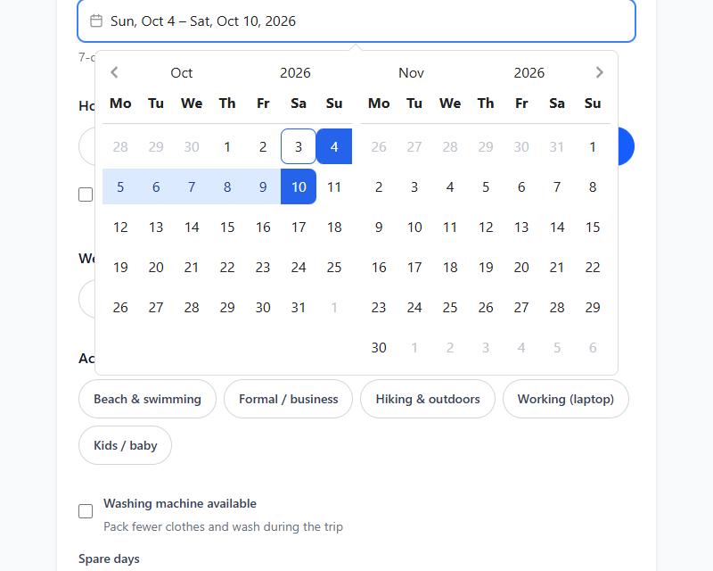

<p align="center">
  <a href="https://packing.ribeirompl.com">
    
  </a>
</p>

# Packing Checklist

Packing Checklist builds a packing list for your trip from a few quick questions: your dates, how
you're travelling, the weather, your activities and whether you can do laundry. It works out how
many of each item to bring, so long trips with a washing machine don't mean packing two weeks of
clothes. Everything is stored in your browser; there's no account and nothing is uploaded. You can
install it on your phone or desktop for an app-like experience.

You can use it here: https://packing.ribeirompl.com

## Features

- **Trip Questionnaire**: Dates, transport (fly / drive / other), international travel, weather
  (hot, cold, rain), activities (beach, formal, hiking, work, kids), laundry and spare days
- **Smart Quantities**: Each item has a rule — per day plus spares (underwear, socks, tops), one
  every N days (trousers, sleepwear) or a fixed count (jacket, swimsuits). With washing available,
  clothes only cover the washing interval: a 14-day trip washing every 5 days with 2 spare days
  needs 7 underwear and 2 trousers
- **Trip Types**: Items are tagged (flying, road trip, international, hot, cold, rain, beach,
  formal, hiking, work, kids, washing) and only included when the trip needs them
- **Pack in Phases**: View the list by category, or by when to pack — ahead of time, last-minute
  (toothbrush, chargers, medication) and a "leaving the house" list (lock up, trash, fridge,
  thermostat)
- **Editable Checklist**: Adjust quantities, add one-off items, remove items, hide packed items
- **Share Links**: Share the full list — including your own items, and optionally what's already
  packed — as a link. The list is compressed into the link itself; opening it shows a preview
  before anything is replaced
- **Customisable Defaults**: About 110 built-in items, each with editable trip tags, quantity rule
  and phase
- **Offline-First and Installable**: Data is stored locally in IndexedDB, and the app can be
  installed on your phone or desktop and used without a connection

## Screenshots

<div style="display:grid;grid-template-columns:repeat(3,240px);gap:12px;justify-content:center;align-items:start">
  <a href="docs/screenshots/questionnaire.png"></a>
  <a href="docs/screenshots/checklist.png"></a>
  <a href="docs/screenshots/phases.png"></a>
  <a href="docs/screenshots/share.png"></a>
  <a href="docs/screenshots/import.png"></a>
  <a href="docs/screenshots/settings.png"></a>
</div>

<p align="center">
  <a href="docs/screenshots/date-picker.png"></a>
</p>

## Limitations

- **Stored in one browser only:** Your lists and settings live in this browser's storage. There's
  no sync between devices, and clearing site data deletes them. To move a list to another device
  or person, use a share link.
- **One checklist at a time:** Generating or importing a checklist replaces the current one.
- **Weather is entered manually:** The app doesn't look up forecasts; choose the weather you expect.

## Installing the App

### iOS Safari

1. Open https://packing.ribeirompl.com in Safari
2. Tap the Share button
3. Select "Add to Home Screen"

### Android Chrome

1. Open https://packing.ribeirompl.com in Chrome
2. Tap the menu (three dots)
3. Select "Install app" or "Add to Home screen"

### Desktop Chrome / Edge

Click the install icon at the right of the address bar, or open the browser menu and choose
"Install Packing Checklist".

## Developer Quick Start

This section is for developers who want to run or build the project locally. If you just want to
use the app, use https://packing.ribeirompl.com.

### Prerequisites

- Node.js 22.22+ or 24.15+
- npm 10 or higher

### Installation

```bash
# Clone the repository
git clone https://github.com/ribeirompl/packing.git
cd packing

# Install dependencies
npm install

# Start development server
npm run dev
```

Open http://localhost:5173 in your browser.

### Building for Production

```bash
# Type-check and build the production bundle into dist/
npm run build

# Preview the production build
npm run preview
```

## Available Scripts

| Command              | Description                                |
| -------------------- | ------------------------------------------ |
| `npm run dev`        | Start development server with hot reload   |
| `npm run build`      | Type-check and build for production        |
| `npm run preview`    | Preview the production build locally       |
| `npm test`           | Run unit tests once with Vitest            |
| `npm run test:unit`  | Run unit tests in watch mode               |
| `npm run type-check` | Type-check the app, tests and config files |
| `npm run lint`       | Run ESLint and fix what it can             |
| `npm run format`     | Format source files with Prettier          |

## Project Structure

```
packing/
├── src/
│   ├── components/
│   │   ├── checklist/    # Checklist rows, add-item form, category summary, share dialog
│   │   ├── common/       # Base inputs, buttons, modal, chips, date range picker, toasts
│   │   └── settings/     # Category and item editors, spare-day preferences
│   ├── views/
│   │   ├── QuestionnaireView.vue  # Trip questions
│   │   ├── ChecklistView.vue      # The packing list (by category / by phase)
│   │   ├── ImportView.vue         # Preview and import a shared list
│   │   └── SettingsView.vue       # Preferences, categories and items
│   ├── composables/      # usePerDayCalculator (quantity rules), useChecklist, …
│   ├── services/
│   │   ├── ChecklistService.ts    # Generate, edit, snapshot and import checklists
│   │   ├── CategoryService.ts     # Categories and item templates
│   │   └── ShareService.ts        # Encode/decode share links
│   ├── db/
│   │   ├── schema.ts              # Dexie (IndexedDB) schema
│   │   ├── catalog.ts             # Default categories and items
│   │   └── seed.ts                # Seeds defaults on first run
│   ├── stores/           # Pinia state
│   ├── types/            # Shared TypeScript types
│   └── router/           # Vue Router (hash mode)
├── tests/unit/           # Vitest unit tests
├── docs/screenshots/     # README screenshots
└── .github/workflows/    # GitHub Pages deployment
```

## Technology Stack

- **Framework**: Vue 3.5 with Composition API
- **Build Tool**: Vite 8 with vite-plugin-pwa (service worker, manifest and icons generated from
  `public/favicon.svg`)
- **State Management**: Pinia 4
- **Routing**: Vue Router 5 (hash mode)
- **Database**: IndexedDB via Dexie.js 4
- **Styling**: Tailwind CSS 4 with Headless UI
- **Dates**: date-fns 4 and @vuepic/vue-datepicker
- **Testing**: Vitest with fake-indexeddb
- **Language**: TypeScript 6 with strict mode

## Deployment

Every push to `main` runs the tests, builds the app and deploys it to GitHub Pages
([`.github/workflows/deploy.yml`](.github/workflows/deploy.yml)), served at
https://packing.ribeirompl.com. Hash-based routing means no server rewrites are needed.
